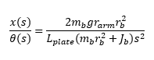
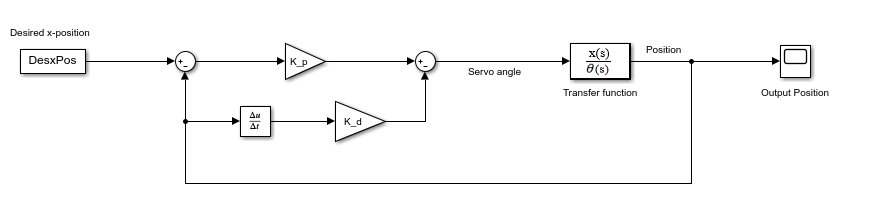
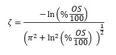
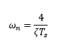
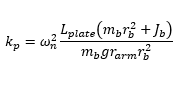
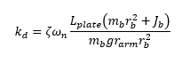
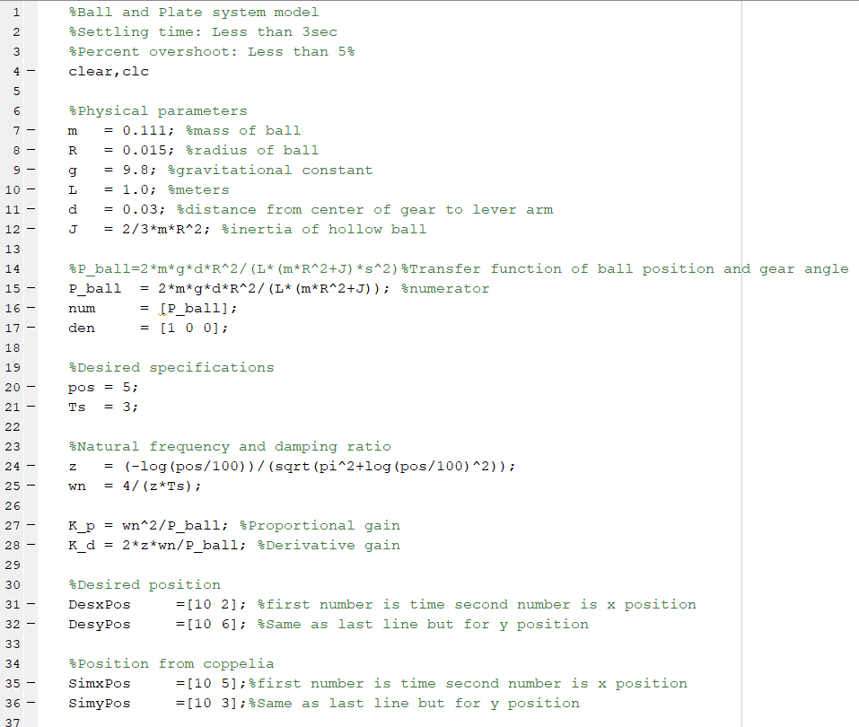
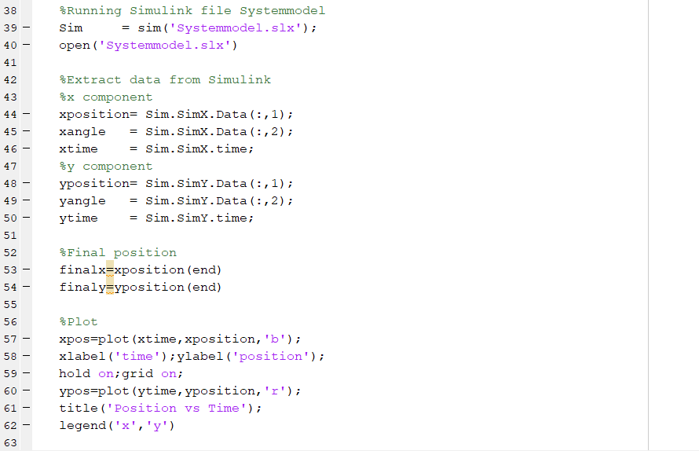
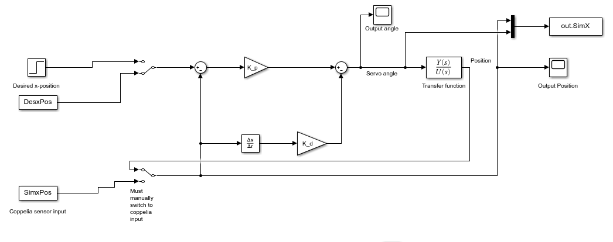

# MECA_482_G6_BallOnPlate
## Meca 482 Control Systems Design Project

                          Project Members: Matthew Rosa, Mark Nelson, Ian Yasui, Dylan Radey

                                          California State University, Chico

                    College of Mechanical and Mechatronic Engineering and Advance Manufacturing

                                                    Ball on Plate

                                                     Spring 2021

Table of Contents
1. [Introduction](https://github.com/mrosa3/G6-BallOnPlate/blob/main/README.md#1-introduction)
2. [Math Model and System Requirements](https://github.com/mrosa3/G6-BallOnPlate/blob/main/README.md#2-math-model-and-system-requirements)
3. [MATLAB and Testing](https://github.com/mrosa3/G6-BallOnPlate/blob/main/README.md#3-matlab-and-testing)
4. [Simulink](https://github.com/mrosa3/G6-BallOnPlate/blob/main/README.md#4-simulink)
5. [Coppelia](https://github.com/mrosa3/G6-BallOnPlate/blob/main/README.md#5-coppelia)
6. [Conclusion](https://github.com/mrosa3/G6-BallOnPlate/blob/main/README.md#6-conclusion)
7. [References](https://github.com/mrosa3/G6-BallOnPlate/blob/main/README.md#7-references)

## 1. Introduction
The ball and plate balancing system consists of a plate which can be tilted by two dual axis servo motors with a ball rolling around on top of the plate. The challenge in this design experiement is to balance the ball on top of the plate to a desired position. This involves using the position of the rotary servo motors attached to the bottom of the plate based on the X-Y position of the ball being measured overhead with a vision sensor. An image of the model can be seen below:

  

<b>Figure 1:</b> Model of ball and plate system

## 2. Math Model and System Requirements
The following modeling is for the x-axis, the modeling is exactly the same for the y-axis due to the axes being independent from each other and the symmetrical nature of the design. From the model in figure 1, solving for the equation of motor of the ball gives the nonlinear equation below:

  

<b>Figure 2:</b> Nonlinear equation of motion

Taking into account the arm of the motor, its relationship to the angle of the plate, and using small angle approximation to linearize the equation gives the following:

  

<b>Figure 3:</b> Linear equation of motion with motor arm

Taking the lapace of the linear equation and solving for the tranfer function gives the following equation:

  

<b>Figure 4:</b> Transfer function
  

Based on the measured ball position, the servo load shaft angle is computed to attain the desired ball position as seen below in the block diagram. The loop of the block diagram controls the servo position using a proportional gain kp and derivative gain kd. 

  

<b>Figure 5:</b> Block diagram of control system

The specifications of the design are a percent overshoot of 5% or less and a settling time of 3 seconds or less. From these specifications the damping ratio and natural frequency can be calculated with the following equations.

  

<b>Figure 6:</b> Equation for Damping Ratio

  

<b>Figure 7:</b> Equation for Natural Frequency

From this the proportional and derivative gain can be determined with the following equations.

  

<b>Figure 8:</b> Equation for Proportional Gain

  

<b>Figure 9:</b> Equation for Derivative Gain

The following is the requirements of a working system defined by the group.

  

<b>Figure 10:</b> Requirements of a working system

## 3. MATLAB and Testing

The following figure is the Matlab code used. The code flows as follows: Clear all possible variables, link to coppelia, set up physical parameters, if connected to coppelia run code, if not display fail connection. If connected to coppelia the code runs as follows: Initialize simulink, set up handles, obtain information from coppelia, update simulink values, run simulink, extract data calculated from simulink, send information to coppelia to change motor angle, repeat as long as coppelia is running.

<b>Figure 11:</b> MATLAB code for the system

To test the mathmatical model and insure that the process acts as intended, the following Matlab code and simulink were used.

  

  

<b>Figure 12:</b> Matlab Code for Testing

  

<b>Figure 13:</b> Simulink for Testing

Note that the switches were originally intended to allow switching between matlab testing and coppelia connection. The final iteration of the simulink is different from this.

Figure 14 below is the output data from Matlab that displays a posiition vs time plot of the ball. 

  

<b>Figure 14:</b> Output data from Matlab

## 4. Simulink

Figure 15 below is the final Simulink file used. The desired position of the ball is manually entered. Then, the position of the ball obtained from coppelia/matlab code is inputed/updated on the left. The simulation is then ran so that a motor angle can be calculated. This calculated value (right side) is transferred to coppelia/matlab code to instruct the motor of the needed angle. 

<b>Figure 15:</b> Simulink diagram for the system

## 5. Coppelia

<b>Figure 14:</b> Coppelia model for the system

The coppelia model was created using multiple joints and dynamic objects. A spherical joint attached to the center rod suspends the plate. The ball is intended to balance ontop of the plate as seen in the model. Two motors are attached for the x and y axis respectively. Spherical joints are attached the revolving joints to acatuate the arms. A vision sensor is used looking down on top of the model to sense the balls position as it moves. 

## 6. Conclusion
Unfortunately, the ball and plate model did not function correctly. There was verification that the coppelia simulation is linked with matlab but the two do not respond together. The video file attached shows that the coppelia simulation has joints that can control the plate but do not correspond to the matlab commands.

## 7. References
[1] Nise, Norman S. Control Systems Engineering. Hoboken, NJ: Wiley, 2015.

[2] Quanser inc. 2 DOF Ball Balancer Woorkbook, 2013.
