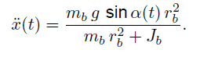
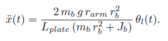

# MECA_482_G6_BallOnPlate
## Meca 482 Control Systems Design Project

                          Project Members: Matthew Rosa, Mark Nelson, Ian Yasui, Dylan Radey

                                          California State University, Chico

                    College of Mechanical and Mechatronic Engineering and Advance Manufacturing

                                                    Ball on Plate

                                                     Spring 2021

Table of Contents
1. [Introduction](https://github.com/mrosa3/G6-BallOnPlate/blob/main/README.md#1-introduction)
2. [Math Model and System Requirements](https://github.com/mrosa3/G6-BallOnPlate/blob/main/README.md#2-math-model-and-system-requirements)
3. [MATLAB and Testing](https://github.com/mrosa3/G6-BallOnPlate/blob/main/README.md#3-matlab-and-testing)
4. [Simulink](https://github.com/mrosa3/G6-BallOnPlate/blob/main/README.md#4-simulink)
5. [Coppelia](https://github.com/mrosa3/G6-BallOnPlate/blob/main/README.md#5-coppelia)
6. [Conclusion](https://github.com/mrosa3/G6-BallOnPlate/blob/main/README.md#6-conclusion)
7. [References](https://github.com/mrosa3/G6-BallOnPlate/blob/main/README.md#7-references)

## 1. Introduction
The ball and plate balancing system consists of a plate which can be tilted by two dual axis servo motors with a ball rolling around on top of the plate. The challenge in this design experiement is to balance the ball on top of the plate to a desired position. This involves using the position of the rotary servo motors attached to the bottom of the plate based on the X-Y position of the ball being measured overhead with a vision sensor. An image of the model can be seen below:

  

<b>Figure 1:</b> Model of ball and plate system

## 2. Math Model and System Requirements
From the model in figure 1, solving for the equation of motor of the ball gives the nonlinear equation below:

  

<b>Figure 2:</b> Nonlinear equation of motion

Taking into account the arm of the motor, its relationship to the angle of the plate, and using small angle approximation to linearize the equation gives the following:

  

<b>Figure 3:</b> Linear equation of motion with motor arm

  

<b>Figure 4:</b> Requirements of a working system

## 3. MATLAB and Testing

## 4. Simulink

## 5. Coppelia

The coppelia model was created using multiple joints and dynamic objects. A spherical joint attached to the center rod suspends the plate. The ball is intended to balance ontop of the plate as seen in the model. Two motors are attached for the x and y axis respectively. Spherical joints are attached the revolving joints to acatuate the arms. A vision sensor is used looking down on top of the model to sense the balls position as it moves. 

## 6. Conclusion
Unfortanely the ball and plate model did not function correctly. There was verification that the coppelia simulation is linked with matlab but the two do not respond together. The video file attached shows that the coppelia simulation has joints that can control the plate but do not correspond to the matlab commands.

## 7. References
